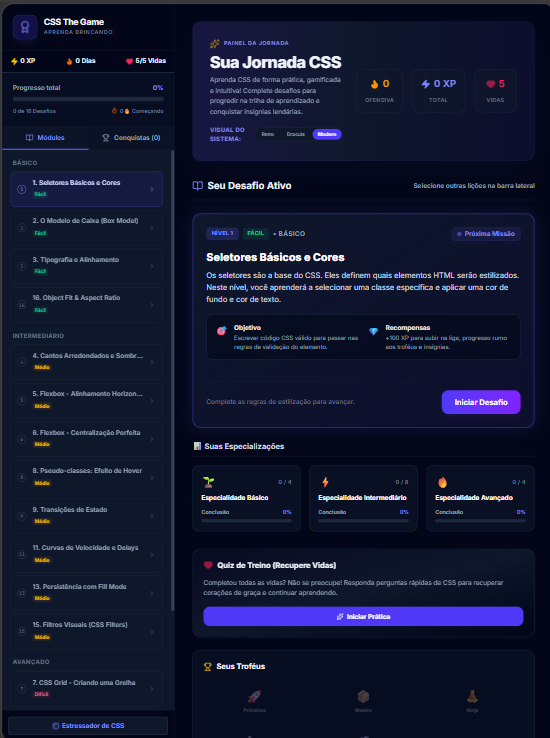
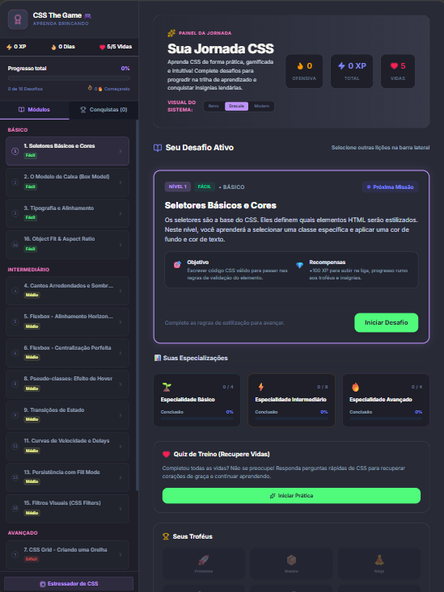
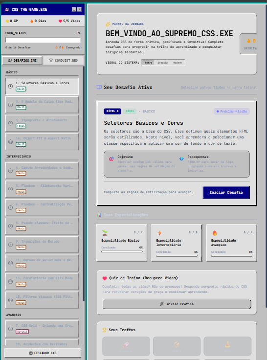
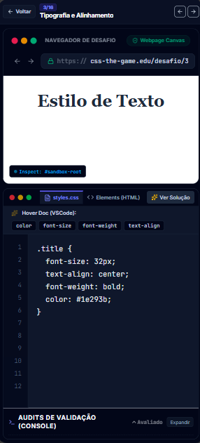

# 🎮 CSS The Game — Aprenda CSS Jogando!

**CSS The Game** é um jogo educacional interativo e gamificado projetado para ensinar CSS (Cascading Style Sheets) de forma divertida, do nível básico ao avançado. Inspirado em mecânicas modernas de gamificação, o projeto fornece feedback visual em tempo real, sistemas de conquistas (achievements), controle de vidas, dias seguidos de prática (streaks), e um console inteligente de diagnóstico.

Este projeto é **100% Client-Side** (roda inteiramente no navegador), livre de dependências de backend ou chaves de API pagas, o que o torna perfeito para hospedar no GitHub Pages de forma gratuita!

---

## 🚀 Demonstração Visual (Aesthetics)

O jogo possui suporte completo a múltiplos temas visuais icônicos que alteram drasticamente a experiência do usuário. Você pode alternar os temas diretamente no painel principal:

<table>
  <tr valign="top">
    <td width="40%">
      <h3>1. 🌌 Modern Indigo (Padrão)</h3>
      <p>Um visual elegante, escuro e de alta fidelidade técnica, utilizando tons sutis de azul profundo, ardósia e gradientes de roxo futurista.</p>
    </td>
    <td width="60%">
      
    </td>
  </tr>
  <tr valign="top">
    <td width="40%">
      <h3>2. 🧛 Dracula Theme</h3>
      <p>Inspirado na clássica e amada paleta de cores para programadores, trazendo o contraste perfeito com destaques em rosa, roxo e verde neon.</p>
    </td>
    <td width="60%">
      
    </td>
  </tr>
  <tr valign="top">
    <td width="40%">
      <h3>3. 💾 Retro Windows 95 / DOS</h3>
      <p>Um retorno nostálgico aos sistemas operacionais clássicos! Botões chanfrados tridimensionais, fontes monoespaçadas, barras de progresso cinzas e bordas duplas pontilhadas.</p>
    </td>
    <td width="60%">
      
    </td>
  </tr>
</table>

---

## 🌟 Principais Recursos

### 🧭 1. Trilha de Jornada de 16 Níveis
Os desafios são progressivos e abordam tópicos essenciais para o desenvolvimento web:
* **Básico:** Seletores de ID, Classes, Cores e Bordas.
* **Intermediário:** Modelo de Caixa (Padding, Margin), Flexbox (Align, Justify), Posicionamento Absoluto.
* **Avançado:** CSS Grid, Transformações 2D, Transições, Animações (`@keyframes`) e Layouts Responsivos complexos.

### 💻 2. Editor de Código de Alta Fidelidade (Inspector)
* **IntelliSense Integrado:** Ao passar o mouse por cima de propriedades CSS comuns, um balão flutuante explica o funcionamento da propriedade detalhadamente com exemplos práticos.
* **Verificação em Tempo Real:** Análise instantânea de erros de sintaxe CSS para guiar o usuário.
* **Abas Editor/Solution:** Possibilidade de visualizar a solução recomendada gastando pontos de experiência.

### 🌐 3. Sandbox Preview Isolada (Webpage Canvas)
* Executa o código CSS inserido de forma totalmente isolada usando técnicas de escopo dinâmico (`#sandbox-root`), garantindo que o CSS digitado mude apenas o elemento do desafio e nunca quebre o visual do jogo principal.
* Simula um navegador real com barra de endereços customizada e botão de recarregar (Reload) para redefinir o nível.

### 🩺 4. Console de Audits Recolhível
* Um terminal inferior diagnóstico (estilo DevTools) valida as regras em tempo real.
* **Design Otimizado:** A aba de validações é recolhível para liberar espaço de digitação em telas menores.

### 🎯 5. Mecânicas de Jogo (Gamificação)
* **XP (Experiência):** Ganhe pontos ao completar desafios e desbloquear conquistas.
* **Vidas (Hearts):** O usuário começa com 5 vidas. Respostas incorretas consomem uma vida.
* **Sistema de Recuperação de Vidas:** Ao ficar sem vidas, o usuário pode resolver um quiz interativo de conceitos teóricos de CSS para recuperar corações!
* **Dias Seguidos (Streaks):** Registra o engajamento diário do aluno.
* **Conquistas (Achievements):** Desbloqueie medalhas lendárias como *Lenda do Flexbox*, *Código Limpo*, ou *Mestre dos Seletores*.

### 🔊 6. Sintetizador de Efeitos Sonoros Nativo
* Utiliza a **HTML5 Web Audio API** para sintetizar ondas senoidais e quadradas em tempo real! Não há carregamento de arquivos de áudio pesados, permitindo efeitos sonoros retrô instantâneos para acertos, erros, cliques e level up.

<table>
  <tr valign="top">
    <td width="70%">
      <h3>📱 7. Responsividade Completa & Modo Paisagem</h3>
      <p>Otimizado para dispositivos móveis! Se o usuário deitar o celular (Modo Paisagem/Landscape), o layout automaticamente se reajusta para o formato de duas colunas semelhante ao desktop (preview à esquerda e editor à direita), maximizando o espaço disponível.</p>
    </td>
    <td width="30%">
      
    </td>
  </tr>
</table>

---

## 🛠️ Tecnologias Utilizadas

* **React 19** + **TypeScript**
* **Vite** (Ambiente de desenvolvimento ultrarrápido)
* **Tailwind CSS v4** (Estilização responsiva e limpa)
* **Motion / Framer Motion** (Animações de transição de tela suaves)
* **Lucide React** (Pacote de ícones moderno)
* **HTML5 Web Audio API** (Sintetizador de áudio nativo)

---

## 🏃 Como Executar Localmente

Siga os passos abaixo para rodar o jogo na sua máquina local:

### 1. Clonar o repositório
```bash
git clone https://github.com/seu-usuario/css-the-game.git
cd css-the-game
```

### 2. Instalar as dependências
```bash
npm install
```

### 3. Iniciar o servidor de desenvolvimento
```bash
npm run dev
```
O projeto estará disponível no endereço: `http://localhost:3000`.

### 4. Compilar para produção
```bash
npm run build
```
Os arquivos estáticos otimizados serão gerados dentro da pasta `/dist`, prontos para serem hospedados em qualquer CDN ou servidor estático.

---

## 📂 Estrutura de Arquivos Principal

```
├── index.html            # Ponto de entrada do documento HTML
├── package.json          # Manifesto do projeto e dependências
├── src
│   ├── App.tsx           # Componente principal (Hub e Fluxo do Jogo)
│   ├── main.tsx          # Inicializador do React e do DOM
│   ├── index.css         # Importações do Tailwind CSS e Fontes do Google
│   ├── types.ts          # Definições de Tipos e Interfaces TypeScript
│   ├── components
│   │   ├── Sidebar.tsx   # Barra lateral com mapa de níveis e conquistas
│   │   ├── CodeEditor.tsx# Editor de código, console de audits e IntelliSense
│   │   └── SandboxPreview.tsx # Sandbox isolada de renderização em tempo real
│   └── utils
│       ├── audio.ts      # Sintetizador de efeitos sonoros nativo
│       └── cssDictionary.ts # Dicionário de ajuda do IntelliSense CSS
```

---

## 🤝 Contribuindo

Contribuições para novos níveis, novos temas visuais ou traduções adicionais são super bem-vindas!
1. Faça um Fork do projeto.
2. Crie uma nova branch com suas mudanças: `git checkout -b feature/meu-novo-nivel`
3. Faça o commit das suas alterações: `git commit -m "feat: adiciona desafio avançado de CSS Grid"`
4. Envie para o GitHub: `git push origin feature/meu-novo-nivel`
5. Abra um Pull Request!

## 📄 Licença

Este projeto está licenciado sob a Licença MIT - veja o arquivo [LICENSE](LICENSE) para mais detalhes.

---
*Desenvolvido com muito ☕ e CSS por apaixonados pelo desenvolvimento Web!*
